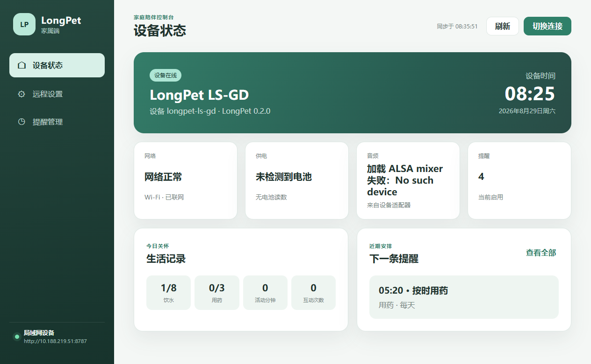

# LongPet Family Desktop

LongPet 家属端桌面应用。它提供设备状态查看、远程设置和提醒管理界面，并通过 Electron 主进程中的 FamilyLink 分层客户端访问 LongPet。

## 当前状态

- 渲染层已迁移为 **Vite + React + Semi Design**，采用适老化的"简洁显眼"视觉风格：
  - 大字号、高对比、大按钮（≥44px）、低信息密度；
  - 顶栏提供**字号三档切换**（标准 / 大 / 特大）与**深色模式**开关，偏好保存在 localStorage；
  - 主进程、preload 白名单 IPC、业务逻辑与协议全部保持不变。
- 演示模式已经形成完整可操作闭环：查看状态、保存设置、创建/编辑/删除提醒；
- 正式 HTTP 客户端及接口校验已经实现；
- 板端已实现带 Token 的 `FamilyLink` 读写闭环，可真实读取状态并远程修改设置、创建/编辑/删除提醒；
- “AI 视野”通过短时会话令牌接收板端 JPEG 与人物跟踪元数据，并在 Canvas 上绘制人物框；
- “AI 视野”页可切换到“远程操控”，在不中断实时画面的情况下控制头部和底盘；
- “AI 视野”页提供互斥的“关闭 / 仅头部 / 人物跟随”模式；人物跟随由 LongPet 本地安全策略驱动，家属端不直接发送自动底盘动作；
- 运动控制使用独立低延迟 WebSocket、临时会话令牌和按住刷新/松开停车语义；窗口失焦、隐藏、切页、断线或退出都会请求 STOP；
- 视频通话和 AI 视野会读取板端发送的摄像头旋转角度，仅校正 LongPet 摄像头画面；
- 配对令牌仅保存在 Electron 主进程内存中，关闭应用后清除。



## 运行

```powershell
npm install
npm run dev        # 开发模式：Vite dev server + 自动启动 Electron（热更新）
npm start          # 生产模式：构建渲染层后启动
```

应用默认使用演示数据。点击右上角"连接设备"，可以配置：

- 演示模式：不依赖开发板；
- 局域网模式：当前开发板地址 `http://192.168.137.32:8787`；
- 配对令牌：作为 Bearer Token 发送，不写入磁盘。

当前板端会报告 `settingsWrite=true` 和 `remindersWrite=true`，家属端据此启用保存、添加、编辑和删除按钮。不可用的单项硬件能力仍单独禁用，例如本板的亮度滑块。

远程操控入口位于“AI 视野”页面右侧标签。底盘使用 W/S/A/D 或页面按钮，Space 立即停车；头部使用 J/K/L；Esc 停车并退出远控。底盘方向必须按住才持续刷新，松开即停车。动作按钮只有在板端报告 UART 可用、Motion MCU 在线、无 fault 且处于 MANUAL 时才会解锁。当前没有开放硬件可靠性尚未确认的 SHIFT 平移。

## 测试与 Release 构建

```powershell
npm run check          # 主进程/preload 语法检查 + 渲染层构建
npm test               # Node 内置测试
npm run build:release  # 构建渲染层 + electron-builder 打包
```

Windows Release 输出目录为：

```text
release/win-unpacked/
```

CI 或本地可通过 `LONGPET_FAMILY_SMOKE_CAPTURE` 指定 PNG 路径，并用 `LONGPET_FAMILY_SMOKE_VIEW` 选择 `dashboard`、`settings`、`reminders` 或 `video-call`。设置 `LONGPET_FAMILY_SMOKE_BASE_URL` 后会等待真实设备数据加载完成再截图；未设置时使用演示模式。应用截图后自动退出，普通启动不受这些变量影响。

写入版提供可清理的真实设备冒烟脚本。它会把音量写回原值以验证设置 revision，然后创建、更新并删除一条停用的临时提醒：

```powershell
$env:LONGPET_FAMILY_SMOKE_BASE_URL='http://10.188.219.51:8787'
$env:LONGPET_FAMILY_SMOKE_TOKEN='<当前 Token>'
npm run smoke:real-write
```

该命令会真实修改板端数据，只应在明确需要自动验证时运行；普通用户手工测试不需要执行它。

## 架构

```text
Renderer UI (Vite + React + Semi Design, dist/renderer)
  -> preload/contextBridge (window.familyDesktop 白名单 IPC)
  -> Electron Main IPC Controller
  -> FamilyLinkService
  -> HttpFamilyLinkAdapter / MockFamilyLinkAdapter
  -> LongPet FamilyLink API（签发短时会话）
  -> Renderer MotionControlAdapter
  -> 独立 Motion WebSocket :8790
  -> LongPet MotionService -> MotionPort -> UART -> Motion MCU
```

Renderer 启用了以下边界（与迁移前一致）：

- `nodeIntegration: false`；
- `contextIsolation: true`；
- `sandbox: true`；
- 生产构建注入 CSP（`connect-src ws: wss:`，允许受控的视频通话和 AI 视野 WebSocket），禁止其他 Renderer 直连；
- 仅通过 preload 暴露的白名单方法访问主进程；
- 外部导航和新窗口默认拒绝。

开发模式（`npm run dev`）通过 `ELECTRON_RENDERER_URL` 环境变量让主进程加载 Vite dev server；生产模式加载 `dist/renderer/index.html`。**主进程 / preload / IPC 通道 / 业务逻辑均未改动**（仅窗口加载路径与冒烟导航等待逻辑做了适配）。

## 目录

```text
src/
  main/
    adapters/             HTTP 与演示 Adapter
    services/             参数校验与业务编排
    index.js              Electron Application
    ipc-controller.js     Renderer 与 Service 的控制层
  preload/                最小 IPC 白名单桥接
  renderer/
    index.html            Vite 入口
    src/
      main.jsx            React 入口（副作用加载媒体适配器）
      App.jsx             应用外壳
      hooks/              useAppState（数据层，封装 window.familyDesktop）
      theme/              主题令牌与字号/深色模式上下文
      components/         侧边栏、顶栏、连接/提醒弹窗
      views/              设备状态、远程设置、提醒管理、语音/视频通话
    video-call-media-adapter.js  视频通话媒体协议适配器（协议逻辑不变）
    vision-monitor-adapter.js    AI 视野媒体、方向校正与人物框绘制
    motion-control-adapter.js    独立运动通道、按住刷新与失效停车
  shared/                 跨主进程模块错误模型
scripts/
  dev.js                  开发模式启动器（Vite + Electron）
tests/                    Node 内置测试
dist/renderer/            渲染层构建产物
docs/
  FAMILY_LINK_API.md      板端接口规范
  IMPLEMENTATION_REPORT.md 实施与验证报告
  screenshots/            冒烟测试截图
```

## 重要文档

- [FamilyLink API 规范](docs/FAMILY_LINK_API.md)
- [Family Remote Control V1 使用与验收](docs/FAMILY_REMOTE_CONTROL_V1.md)
- [MVP 实施报告](docs/IMPLEMENTATION_REPORT.md)
